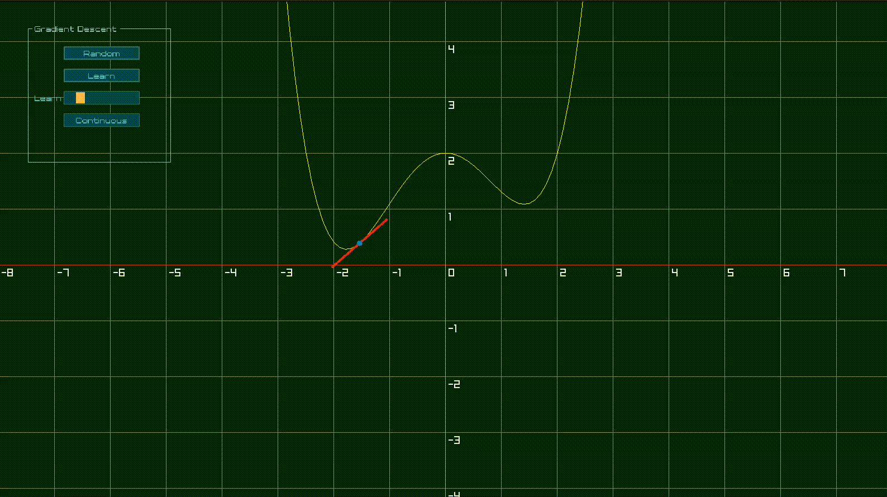
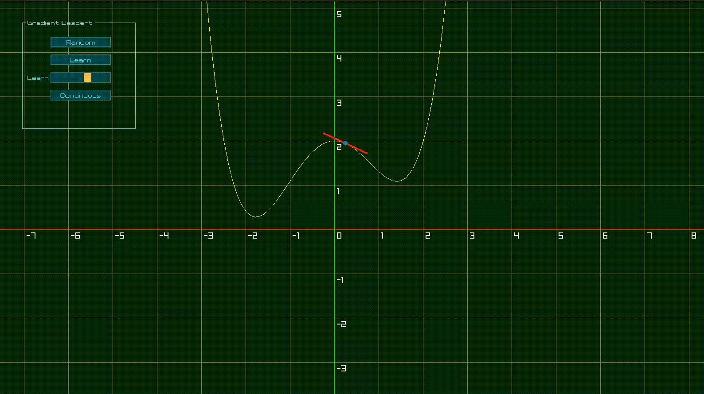

# Gradient Descent 2D Visualizer

This project is an educational tool designed to help understand gradient descent in 2D space. It provides a visual representation of the gradient descent algorithm, allowing users to interact with and observe the process in real-time.

## Features

- Interactive 2D visualization of gradient descent
- Adjustable learning rate
- Random initialization of target value
- Continuous learning mode

## Building the Project

To build the project, you need to have the following dependencies installed:

- GCC compiler
- [Raylib](https://www.raylib.com/) library
- pkg-config

Once you have the dependencies, follow these steps:

1. Clone the repository.
2. Navigate to the project directory.
3. Run the following command:

```
make
```

## Running the Project

```
./build/main
```

## Demo






## Author

Mohammed Alhaddar

## License

This project is licensed under the MIT License.


